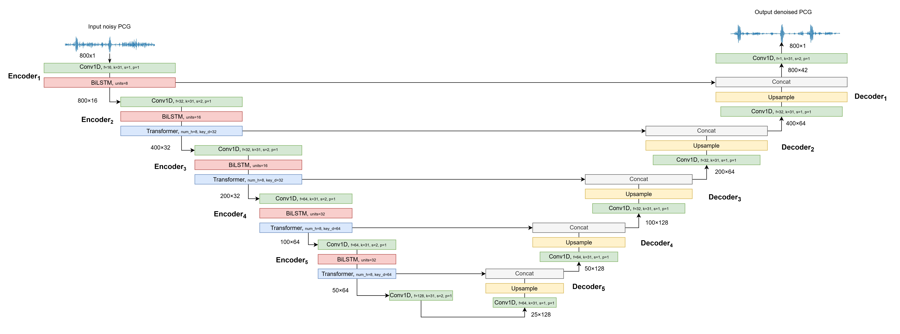

# Transformer-BiLSTM Network for Denoising Phonocardiogram Signals

This repository contains the code and resources for our paper:

**"A Robust Deep Learning based Model for Denoising Phonocardiogram Signals in Clinical Environments"**

We propose a novel deep learning architecture for denoising real-world phonocardiogram (PCG) signals. The model, named **T-BiLSTM**, combines a convolutional U-Net backbone with **Bidirectional LSTM layers** and **Transformer blocks with multi-head attention** to effectively remove both ambient and physiological noise from heart sound recordings.

This repository was developed by extending and modifying the original **LU-Net** implementation by Shams Nafisa Ali et al.:  
🔗 [https://github.com/ShamsNafisaAli/LU-Net-Heart-Sound-Denoising-](https://github.com/ShamsNafisaAli/LU-Net-Heart-Sound-Denoising-)

We thank the authors for making their code publicly available.

## Model Architecture

The following diagram shows the high-level architecture of the proposed **T-BiLSTM** model:

## Repository Structure

