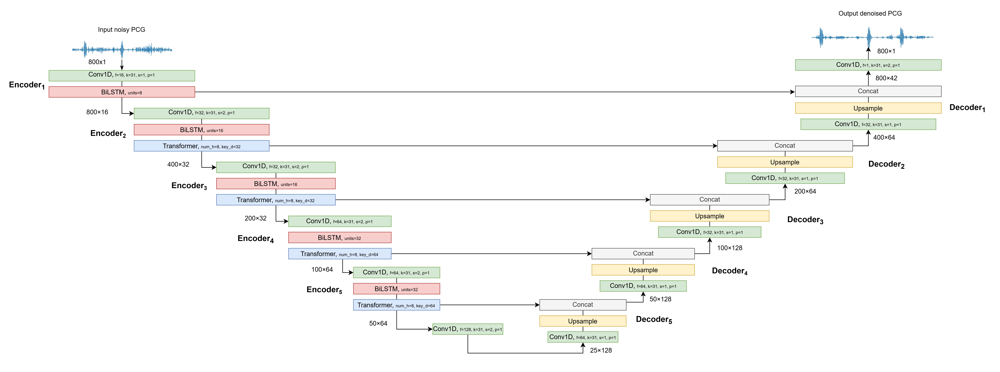

# Transformer-BiLSTM Network for Denoising Phonocardiogram Signals

This repository contains the code and links to the deployed datasets for our study entitled:

**"A Robust Deep Learning based Model for Denoising Phonocardiogram Signals in Clinical Environments"**

We proposed a novel deep learning architecture for denoising real-world phonocardiogram (PCG) signals. The model, named **T-BiLSTM**, combines a convolutional U-Net backbone with **Bidirectional LSTM layers** and **transformer blocks with multi-head attention** to effectively remove both ambient and physiological noise from heart sound recordings.

To allow a fair benchmark with the other models published in the literature, some scripts, i.e., config.py, matrices.py, processing_initial.py and utils.py, coming from the original LU-Net implementation developed by Shams Nafisa Ali et al.: 🔗 [https://github.com/ShamsNafisaAli/LU-Net-Heart-Sound-Denoising-](https://github.com/ShamsNafisaAli/LU-Net-Heart-Sound-Denoising-), were re-used in our implementations. We acknowledge and thank the authors for making their code accessible to the community.

## Model Architecture

The following diagram shows the high-level architecture of the proposed **T-BiLSTM** model:

## Quick Start Guide:

This section outlines the essential steps to prepare the data, train the model, and evaluate its performance.

---

## Dataset Preparation

1. **Download Datasets**  
   - Download all required PCG datasets. Dataset links and licensing info are provided in `data_link.txt`.

2. **Compute Dataset Statistics**  
   - Run [`datasets_stats.py`](./datasets_stats.py) to analyze the datasets and prepare a summary useful for configuring the training pipeline.

3. **Preprocess and Segment Data**  
   - Run [`preprocessing_data.py`](./preprocessing_data.py) to:
     - Apply a bandpass filter (25–400 Hz),
     - Remove spikes and stationary noise,
     - Normalize signals to [-1, 1],
   - Output files will be stored in the folder you specify in the script.

---

## Training

- Launch model training by running [`Codes/training_model.py`](./Codes/training_model.py).  
- This script loads the processed training data and trains the T-BiLSTM model using the specified loss function and optimizer.  
- Model checkpoints and training logs are automatically saved.

---

## Testing

- Run [`Codes/testing_data.py`](./Codes/testing_data.py) to:
  - Load the best model checkpoint,
  - Perform inference on unseen noisy PCG signals,
  - Calculate evaluation metrics.

---

Make sure to adjust paths and parameters in `config.py` before starting the pipeline.

---
## Citation
If you use this repository, the T-BiLSTM model, or any part of the provided source code in your research, please cite the following article:

M. Jakubec, E. Lieskovska, and P. Pocta, “A robust deep learning based model for denoising phonocardiogram signals in clinical environments,” Engineering Applications of Artificial Intelligence, vol. 161, art. no. 112286, 2025. https://doi.org/10.1016/j.engappai.2025.112286
---

@article{Jakubec2025,
  author  = {Jakubec, Maros and Lieskovska, Eva and Pocta, Peter},
  title   = {A robust deep learning based model for denoising phonocardiogram signals in clinical environments},
  journal = {Engineering Applications of Artificial Intelligence},
  volume  = {161},
  pages   = {112286},
  year    = {2025},
  issn    = {0952-1976},
  doi     = {10.1016/j.engappai.2025.112286},
  url     = {https://doi.org/10.1016/j.engappai.2025.112286}
}
